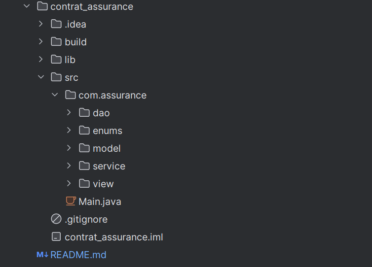
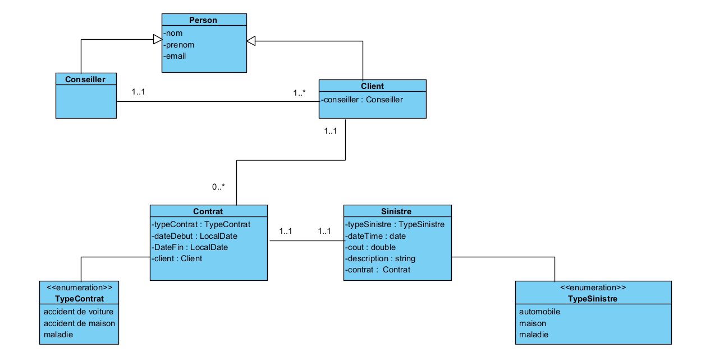

# Gestion Bancaire - Application Console Java

## Description du projet
Ce projet est une application Java de gestion d'assurance permettant de gérer des conseillers, des clients, des contrats d'assurance et des sinistres. L'application utilise une architecture MVC (Modèle-Vue-Contrôleur) et s'appuie sur une base de données PostgreSQL pour le stockage des données. Les fonctionnalités incluent la création, la lecture, la mise à jour et la suppression (CRUD) des entités, avec génération automatique des identifiants via des séquences en base de données.
## Fonctionnalités principales :

- Gestion des Conseillers : Ajouter, afficher, modifier et supprimer des conseillers.
- Gestion des Clients : Ajouter, afficher, modifier et supprimer des clients, avec association à un conseiller.
- Gestion des Contrats : Ajouter, afficher, modifier et supprimer des contrats d'assurance (types : AUTOMOBILE, MAISON, MALADIE).
- Gestion des Sinistres : Ajouter, afficher, modifier et supprimer des sinistres associés à un contrat.
- Génération Automatique des IDs : Utilisation de séquences PostgreSQL pour générer automatiquement les identifiants des entités.

---

## Technologies utilisées
- **Java 8**
- JDBC
- Streams API, Optional, Lambda, Method References
- Java Time API
---

## Structure du projet

- **Structure**
  

- **Diagramme de class**

